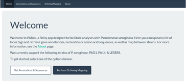

# PATool

### Available [here!](https://travis-m-blimkie.shinyapps.io/PATool/)  

This Shiny app was built to retrieve annotations and nucleotide/amino acid
sequences, as well as map between strains, of *Pseudomonas aeruginosa.* We
currently support the following strains:

* PAO1
* PA14
* LESB58

It utilizes annotations from the [Pseudomonas Genome
Database](http://pseudomonas.com/), while ortholog information is taken from
[OrtholugeDB](http://pseudoluge.pseudomonas.com/). Sequences are in the
multi-fasta format with descriptive headings, designed to be compatible with
programs such as batch submission to NCBI's BLAST. If you run into a bug or
problem, open an issue and I'll look into it.

Available with the MIT license. 

***

