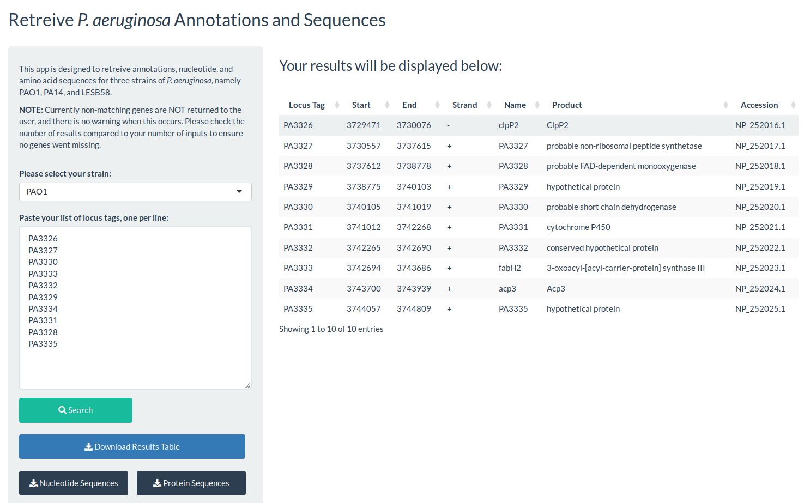

# getPASequences

### Available [here!](https://travis-m-blimkie.shinyapps.io/getPASequences/)  

This Shiny app was built to retrieve annotations and nucleotide/amino acid
sequences for *Pseudomonas aeruginosa* strains PAO1, PA14, and LESB58. Utilizes
annotations from the [Pseudomonas Genome Database](http://pseudomonas.com/) for
mapping. Annotations and sequences can each be downloaded as separate files.
Sequences are in the multi-fasta format with descriptive headings, designed to
be compatible with programs such as batch submission to NCBI's BLAST.
Available with the MIT license. 

***

